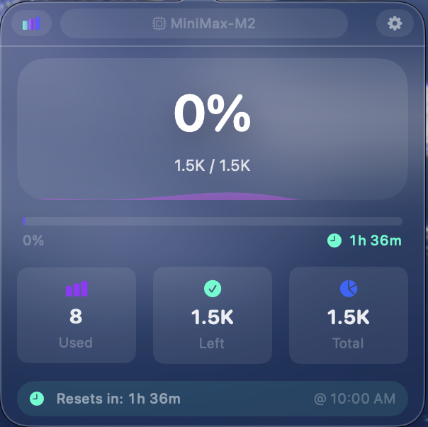

# MiniMax Menu Monitor

A beautiful native macOS menu bar app that tracks your MiniMax API usage with a stunning liquid glass interface.

<table>
  <tr>
    <td></td>
    <td></td>
    <td></td>
  </tr>
</table>

> **Disclaimer**: This project is not affiliated with, endorsed by, or officially connected to MiniMax.

## Features

- 🍏 **Native macOS App** - Runs quietly in your menu bar
- ✨ **Liquid Glass Design** - Stunning frosted glass UI with smooth animations
- 📊 **Real-time Tracking** - Monitors your MiniMax API usage
- 🔒 **Secure Storage** - API keys stored safely in macOS Keychain
- ⚙️ **Customizable** - Configure refresh intervals and preferences
- 🚀 **Quick Setup** - Enter your API key directly in the app's settings

## Installation

### Build from Source (Recommended)

Since this is an unsigned app without a paid Apple Developer account:

```bash
# Clone the repository
git clone https://github.com/doublezz10/minimax-menu-monitor.git
cd minimax-menu-monitor

# Run setup script
chmod +x setup.sh
./setup.sh

# Launch the app
open build/Debug/MinimaxMenuMonitor.app
```

**First Launch:**
1. After running `./setup.sh`, the app will be built
2. On first launch, right-click the app and select "Open"
3. The app will open in your menu bar
4. Click the icon to open the popover, enter your MiniMax API key in Settings

**Requirements:**
- macOS 12.0 (Monterey) or later
- Xcode Command Line Tools (`xcode-select --install`)
- Homebrew (for XcodeGen)

### Future: Signed Releases

Signed `.app` bundles with automatic Gatekeeper approval require a paid Apple Developer Account ($99/year). This may be added in a future release.

For now, building from source is the recommended approach.

## Getting Your MiniMax API Key

1. Visit [MiniMax Platform](https://platform.minimax.io)
2. Sign in to your account
3. Navigate to API settings
4. Generate a new API key
5. Open the app and enter it in Settings (opens automatically on first launch)

## Usage

### First Launch

On first launch, the app opens directly to **Settings** where you can enter your MiniMax API key. Once configured, you'll automatically see the **Usage** view with your token usage.

### Popover

Click the menu bar icon to view:
- Usage percentage with animated progress ring
- Used / Total / Remaining tokens
- Time until quota resets
- Quick actions (Refresh, Settings)

### Settings

Access settings by clicking the gear icon:

- **API Key** - Enter or update your MiniMax credentials
- **Refresh Interval** - How often to check usage (10-300 seconds)
- **Quit App** - Exit the application

## Menu Bar Icon Visibility

If the icon is hard to see on certain backgrounds, try:
1. **Dark backgrounds**: The icon uses light colors for contrast
2. **Light backgrounds**: The icon uses subtle colors that may be less visible
3. **Overflow menu**: Check the ▼ menu if icon doesn't appear

## Architecture

```
MinimaxMenuMonitor/
├── project.yml              # XcodeGen configuration
├── setup.sh                 # Build script
├── CHANGELOG.md             # Release notes
├── README.md                # This file
├── Sources/
│   ├── App/                 # App lifecycle & menu bar
│   ├── Models/              # Data models
│   ├── Services/            # API, Keychain, Monitoring
│   ├── Views/               # SwiftUI views
│   └── Utilities/           # Extensions, helpers
└── Resources/               # Assets, Info.plist
```

## Development

### Building

```bash
# Generate Xcode project
xcodegen generate

# Build
xcodebuild -project MinimaxMenuMonitor.xcodeproj \
    -scheme MinimaxMenuMonitor \
    -configuration Debug \
    build

# Run
open build/Debug/MinimaxMenuMonitor.app
```

### Project Structure

- **SwiftUI** for all UI components
- **@MainActor** for thread safety
- **Protocol-oriented** design
- **Reactive** data flow with `@StateObject` and `@Published`

## Contributing

Contributions are welcome! Please read CONTRIBUTING.md for guidelines.

1. Fork the repository
2. Create a feature branch
3. Make your changes
4. Submit a pull request

## Security

- ✅ API keys stored in macOS Keychain
- ✅ No hardcoded credentials
- ✅ No external servers or tracking
- ✅ Local-first design

## Troubleshooting

### App won't open
- macOS 12.0+ required
- Right-click → "Open" if Gatekeeper blocks
- Check the app is extracted from .zip

### Usage not showing
- Verify API key in Settings
- Check internet connection
- Ensure MiniMax API is accessible

### Menu bar icon missing
- Check the overflow menu (▼)
- Restart the app
- Check System Settings → Menu Bar

### High CPU/battery usage
- Increase refresh interval in Settings
- Default 60 seconds is recommended

## Support

- **Issues**: [GitHub Issues](https://github.com/doublezz10/minimax-menu-monitor/issues)
- **Discussions**: [GitHub Discussions](https://github.com/doublezz10/minimax-menu-monitor/discussions)
- **Feature Requests**: Open an issue with "enhancement" label

## License

MIT License - see [LICENSE](LICENSE) for details.

## Acknowledgments

- [MiniMax](https://minimax.io) for their excellent API
- [Apple](https://developer.apple.com) for SwiftUI and macOS
- [SF Symbols](https://developer.apple.com/sf-symbols/) for beautiful icons
